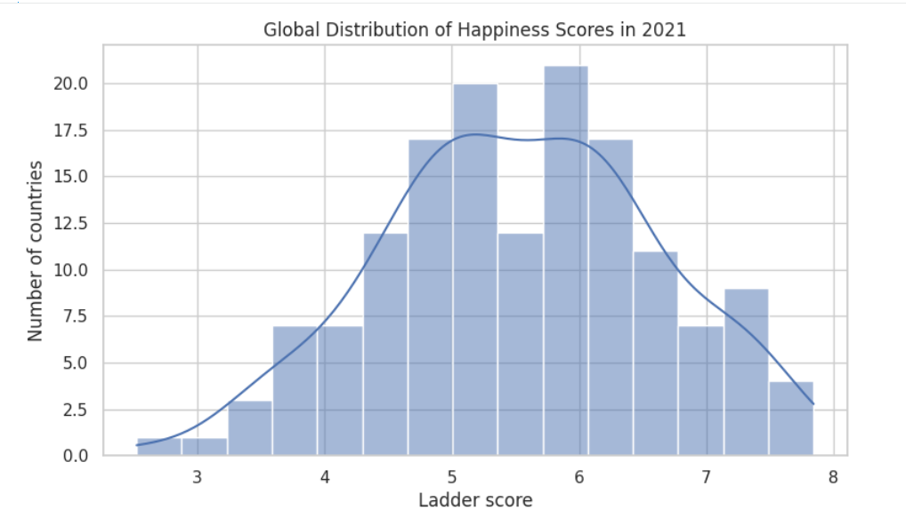
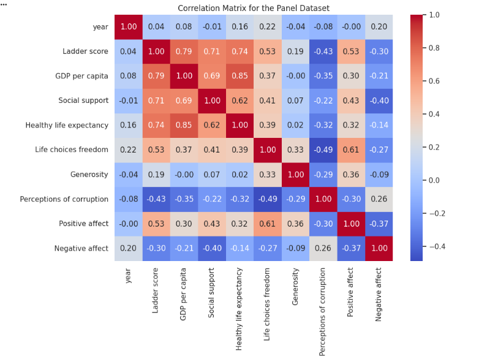
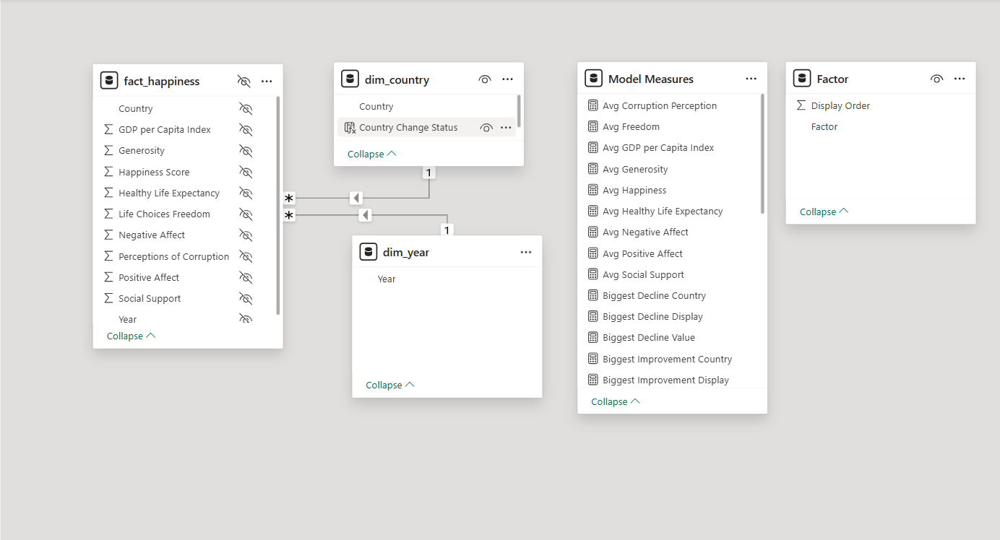
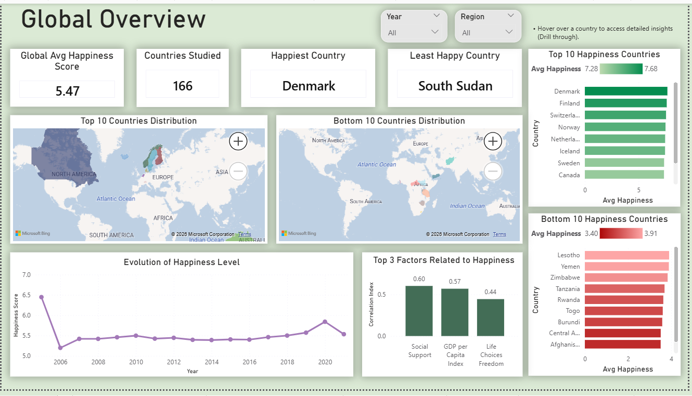
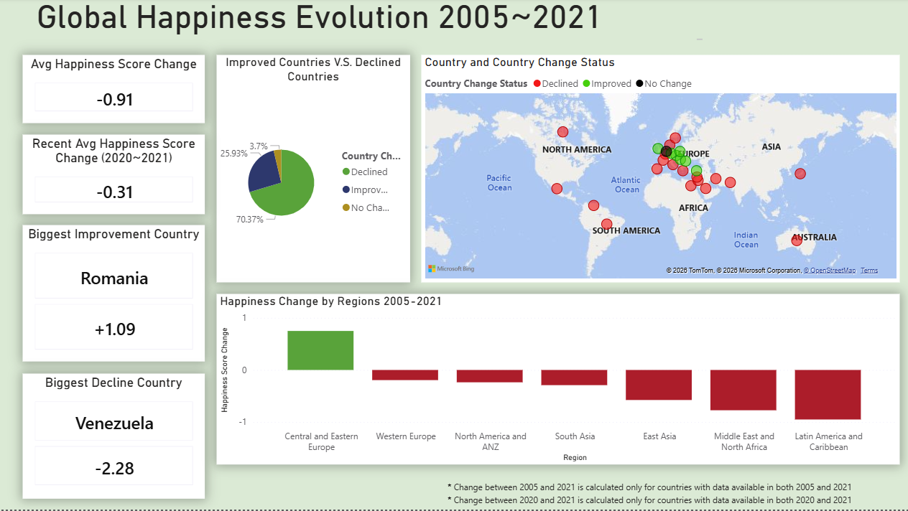
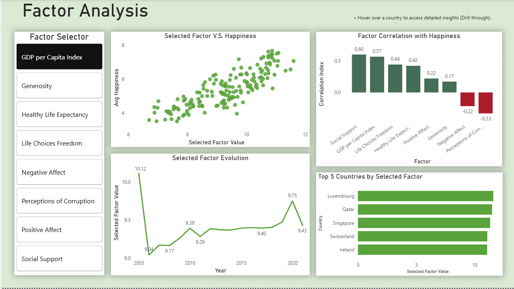
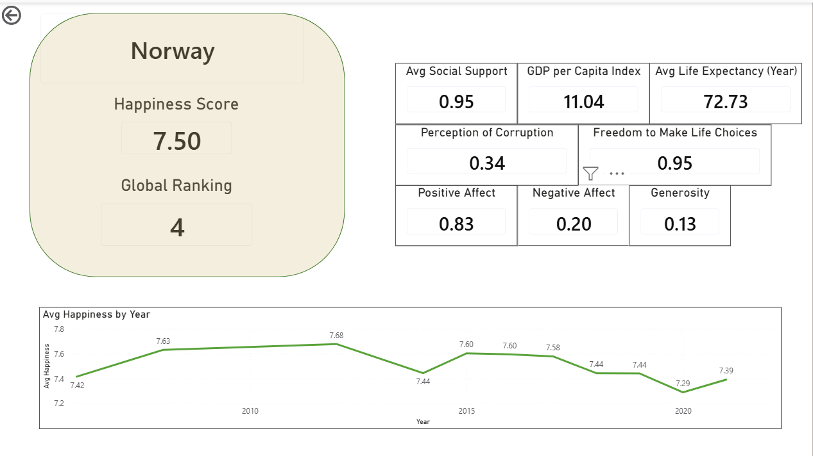
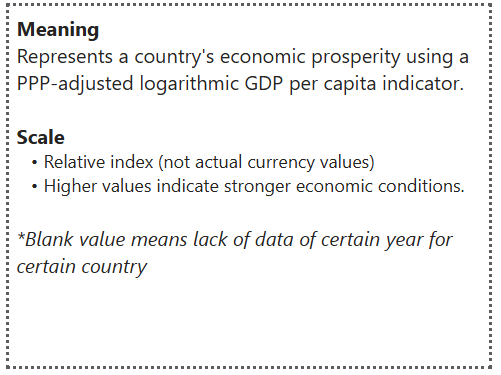

# World Happiness Report Analysis

An end-to-end BI project combining Python and Power BI to explore global happiness patterns across countries and regions. The project includes data cleaning, ETL, star schema modeling, DAX development, and the creation of an interactive multi-page Power BI report.

## Highlights
- Built an end-to-end BI project from raw World Happiness Report datasets.
- Cleaned and reshaped two inconsistent datasets into a 2005-2021 fact table.
- Designed a star schema with country and year dimensions.
- Created 37 DAX measures organized by analytical purpose.
- Built a Power BI dashboard with drill-through, custom tooltips, dynamic factor selection, and interactive filtering.

## Project Structure

```text

world-happiness-report-powerbi-analysis/
├── README.md
├── original_data/
│   ├── world-happiness-report.csv
│   └── world-happiness-report-2021.csv
├── processed_data_for_modeling/
│   ├── fact_happiness.csv
│   └── dim_country.csv
├── notebooks/
│   ├── world_happiness_report_analysis.ipynb
│   └── data_prep_for_modeling.ipynb
├── powerbi/
│   └── world_happiness_report.pbix
└── screenshots/
    ├── overview.png
    ├── happiness_evolution.png
    ├── factor_analysis.png
    ├── drill-through.png
    ├── data_model.png
    ├── tooltip_example.png
    ├── correlation_matrix.png
    └── happiness_score_distribution_2021.png
```

## How to Use

1. Open [world_happiness_report_analysis](notebooks/world_happiness_report_analysis.ipynb) and [data_prep_for_modeling](notebooks/data_prep_for_modeling.ipynb) notebooks to review the analysis and data preparation process.
   To reproduce the codes, open them in Google Colab by this [link](https://colab.research.google.com/github/ruonezhang/world-happiness-report-powerbi-analysis/blob/main/notebooks/world_happiness_report_analysis.ipynb) for EDA analysis and this [link](https://colab.research.google.com/github/ruonezhang/world-happiness-report-powerbi-analysis/blob/main/notebooks/data_prep_for_modeling.ipynb) for data modeling preparation. Then click on "Run all". An automatic script was implemented, thus no need to download any data file. 
2. Open [world_happiness_report.pbix](powerbi/world_happiness_report.pbix) in Power BI Desktop.
3. Review the data model, DAX measures, dashboard pages, drill-through page, and tooltip pages.
4. Use slicers and the factor selector to explore countries, regions, years, and happiness drivers interactively.

## Project Overview

This project analyzes the World Happiness Report dataset to understand how happiness varies across countries, regions, and time, and which factors are most strongly associated with national happiness.

The work includes two main parts:

- **Python analysis:** exploratory data analysis using the 2021 World Happiness Report dataset, supported by the 2005-2020 panel dataset for time-based and emotional indicator analysis. In addition, Python was also used to prepare data for modeling in Power BI.
- **Power BI dashboard:** a full interactive report built from a cleaned 2005-2021 fact table, modeled with a star schema and supported by 37 DAX measures.

## Business Questions

- Which countries and regions have the highest and lowest happiness scores?
- How has global happiness changed from 2005 to 2021?
- Which factors are most strongly related to happiness?
- Do countries with the highest GDP per capita always have the highest happiness scores?
- How can users move from a global overview to country-level detail in an interactive dashboard?

## Dataset

Data source: [World Happiness Report 2021 on Kaggle](https://www.kaggle.com/datasets/ajaypalsinghlo/world-happiness-report-2021)

The project uses two raw datasets:

- [world-happiness-report-2021.csv](original_data/world-happiness-report-2021.csv): country-level 2021 happiness indicators.
- [world-happiness-report.csv](original_data/world-happiness-report.csv): panel dataset covering happiness indicators from 2005 to 2020.

For the Power BI model, both datasets were cleaned, aligned, and combined into a single analytical table covering:

- **2005-2021**
- **166 countries**
- **10 regions**
- **2,098 country-year records**

## Tools Used

- Python
- Pandas
- NumPy
- Matplotlib
- Seaborn
- Power BI
- Power Query
- DAX

## Python Analysis

The Python notebook focuses mainly on the 2021 dataset, using the 2005-2020 panel dataset as supporting context.

Main analysis steps:

- Inspected dataset structure, missing values, and duplicate records.
- Removed derived score-contribution columns from the 2021 dataset to avoid circular interpretation.
- Compared top and bottom countries by happiness score.
- Analyzed regional and continent-level happiness patterns.
- Explored correlations between happiness and explanatory factors.
- Used the panel dataset to examine long-term trends and emotional indicators such as positive and negative affect.




Key Python findings:

- Social support, GDP per capita, and healthy life expectancy show the strongest positive relationships with happiness.
- Perceptions of corruption and negative affect are negatively related to happiness.
- Regional context plays an important role in happiness differences.
- GDP is important, but high GDP alone does not guarantee the highest happiness score.

## Power BI Data Modeling

The strongest part of this project is the Power BI modeling and dashboard design.

The original datasets were not directly suitable for a clean Power BI model because they had different structures:

- The 2021 dataset included `Regional indicator`, but did not include `Positive affect` or `Negative affect`.
- The panel dataset included `Positive affect` and `Negative affect`, but did not include `Regional indicator`.
- Column names and time fields needed to be standardized before combining the datasets.

To solve this, I used Python to:

- Standardize column names across both datasets.
- Add a `Year` column to the 2021 dataset.
- Rename the panel dataset's `year` field to `Year`.
- Map regions from the 2021 dataset to the panel dataset by country.
- Manually assign regions for valid panel countries missing from the 2021 regional mapping.
- Add missing emotional indicator fields to the 2021 dataset as blank values instead of imputing non-existent data.
- Vertically combine both datasets into one fact table.
- Validate the uniqueness of the `Country + Year` grain.
- Export cleaned tables for Power BI.

The final Power BI model uses a star schema:

- `fact_happiness`: central fact table at the country-year level.
- `dim_country`: country and region dimension.
- `dim_year`: annual time dimension created in Power BI.
- `Factor`: disconnected table used for dynamic factor selection.
- `Model Measures`: centralized DAX measure table.

Relationships:

- `dim_country[Country]` 1-to-many `fact_happiness[Country]`
- `dim_year[Year]` 1-to-many `fact_happiness[Year]`
- Single-direction filtering for a clean semantic model.

The model also hides raw numeric columns and uses measures to guide report users toward consistent calculations.



## DAX Measures

The report includes **37 DAX measures**, organized into folders by purpose.

Measure categories include:

- **KPI measures:** average happiness, country count, average GDP, average social support, average life expectancy.
- **Ranking measures:** top happiness country, bottom happiness country, global happiness rank.
- **Evolution measures:** happiness change from 2005 to 2021, recent change from 2020 to 2021, regional average change.
- **Display measures:** formatted improvement and decline values for user-friendly cards.
- **Dynamic factor measures:** selected factor value, selected factor description, and factor correlation measures.

These measures make the dashboard more consistent, interactive, and maintainable.

## Power BI Dashboard

The Power BI report was designed as an interactive analytical tool rather than a collection of static charts.

It includes:

- **3 main analytical pages**
- **1 country drill-through page**
- **9 custom tooltip pages**
- **Dynamic factor selector**
- **Interactive slicers**
- **Map visuals**
- **Ranking visuals**
- **Trend analysis**
- **Country-level detail view**

### Page 1: Global Overview

The overview page gives users a high-level view of global happiness.

It includes:

- Global average happiness score.
- Number of countries studied.
- Happiest and least happy countries.
- Top and bottom country rankings.
- Geographic distribution maps.
- Global happiness trend.
- Top factors related to happiness.



### Page 2: Happiness Evolution

This page focuses on how happiness changed over time.

It includes:

- Average happiness score change from 2005 to 2021.
- Recent happiness score change from 2020 to 2021.
- Biggest improvement country.
- Biggest decline country.
- Improved vs declined country classification.
- Regional happiness change comparison.
- Geographic map of change status.



### Page 3: Factor Analysis

This page investigates the drivers of happiness.

It includes:

- Dynamic factor selector.
- Scatter plot comparing selected factor value with happiness.
- Factor correlation ranking.
- Selected factor trend over time.
- Top countries by selected factor.

The dynamic factor setup allows one group of visuals to switch between GDP, social support, life expectancy, freedom, generosity, corruption perception, positive affect, and negative affect.



### Country Drill-Through Page

The drill-through page allows users to move from global analysis to a country-level profile.

It includes:

- Selected country name.
- Happiness score.
- Global ranking.
- GDP per capita index.
- Social support.
- Life expectancy.
- Freedom to make life choices.
- Generosity.
- Corruption perception.
- Positive affect.
- Negative affect.
- Country happiness trend over time.



### Custom Tooltip Pages

The report includes 9 custom tooltip pages explaining key metrics:

- Happiness Score
- GDP per Capita
- Social Support
- Healthy Life Expectancy
- Freedom
- Generosity
- Corruption Perception
- Positive Affect
- Negative Affect

Each tooltip provides metric meaning, scale explanation, and interpretation guidance without cluttering the main dashboard.



## Key Insights

- **Social support, GDP per capita, and healthy life expectancy are the strongest positive correlates of happiness.**
- **High GDP does not automatically mean the highest happiness score.** Economic prosperity matters, but happiness is also shaped by social, health, emotional, and institutional factors.
- **Western Europe and North America are among the happiest regions**, while **Sub-Saharan Africa has the lowest average happiness levels**.
- **Global happiness decreased from 2005 to 2021**, and also declined from 2020 to 2021.
- **Central and Eastern Europe showed the strongest regional improvement from 2005 to 2021**, while **Latin America and the Caribbean experienced the largest decline**.

## Limitations

The main limitation is related to the 2005-2020 panel data coverage.  
Some countries do not have complete observations for both 2005 and 2021, so the sample size on the Happiness Evolution page is smaller when calculating long-term change. To avoid creating artificial results, missing values were not imputed for unavailable indicators.
